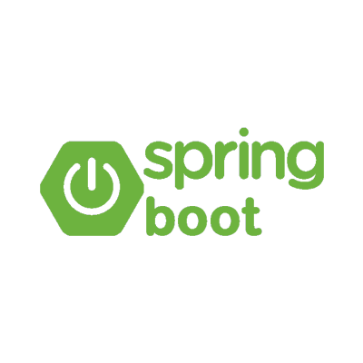
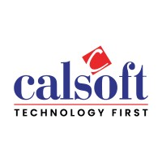

# Project Name

## Technologies Used

### Java

### Spring Boot

### Docker

### GitHub

### Postman

### Calsoft

## About the Project
This project uses modern technologies and tools to build and deploy a robust solution. Each technology plays a specific role in the development and deployment pipeline.

- **Java**: Core programming language for building the application.
- **Spring Boot**: Framework for creating microservices and REST APIs.
- **Docker**: Containerization platform for consistent application deployment.
- **GitHub**: Repository hosting for version control and collaboration.
- **Postman**: API testing and debugging tool.
- **Calsoft**: Representing the organization or brand associated with this project.

